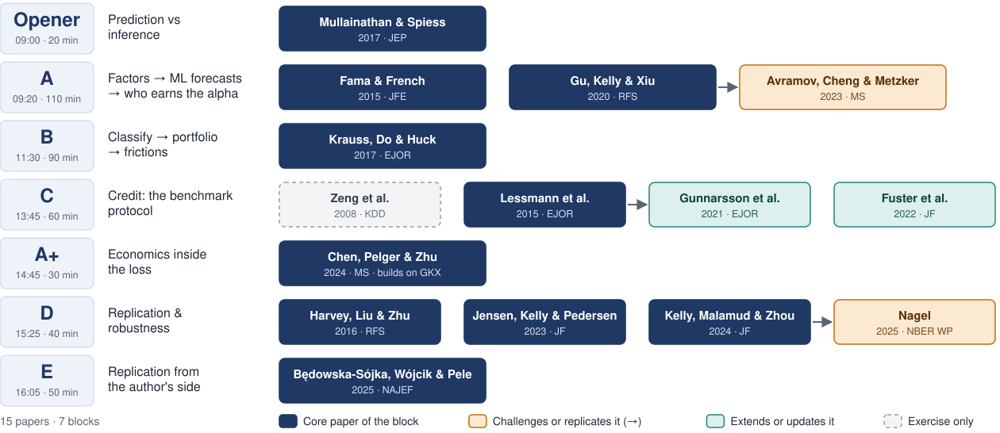

<!-- _class: cover -->
<!-- _paginate: false -->
<!-- _footer: "" -->
<!-- cover -->
# Paper cards
## The day's papers, one slide each

Barbara Będowska-Sójka · Poznań University of Economics and Business

MSCA Doctoral Network Digital Finance · MSCA_DF_10 Introduction to AI for Financial Applications

---

<!-- _class: card -->
# The day's papers at a glance

---

# How to use the cards

- Read the cards before the day: about 2 minutes per paper.
- Every card has the same rows: **question, data, method, how it is tested, main result, what to watch for, code & data**.
- **→ poll in class** marks a result we will ask you to guess before we show it. Do not look it up.
- The *Watch for* row is where the discussion starts. Come with one answer.
- The references and links are in `Reading_list.pdf`. Read at least one paper in full.

---

<!-- _class: card -->
<!-- card:ms -->
# Paper card: Mullainathan & Spiess (2017)

| | *Journal of Economic Perspectives* 31(2): 87–106 |
|---|---|
| **Question** | What is machine learning good for in applied economics, and what is it not good for? |
| **Data** | American Housing Survey 2011: predict house values from 150 variables; 10,000 training and 41,808 hold-out units. |
| **Method** | OLS vs regression tree, LASSO, random forest and an ensemble, tuned by cross-validation. |
| **How it is tested** | Hold-out $R^2$; LASSO re-fitted on ten random partitions of the data. |
| **Main result** | ML predicts better, but modestly: hold-out $R^2$ 41.7% (OLS) vs 45.9% (ensemble). LASSO picks different variables in each partition with the same fit. |
| **Watch for** | "ML belongs in the $\hat y$ compartment, not the $\hat\beta$ compartment." A selected variable is not a finding. |
| **Code & data** | Replication files on openICPSR (project 113993). |

---

<!-- _class: card -->
<!-- card:ff -->
# Paper card: Fama & French (2015)

| | *Journal of Financial Economics* 116: 1–22 |
|---|---|
| **Question** | Do profitability (RMW) and investment (CMA) factors, added to the three-factor model, explain average stock returns better? |
| **Data** | US stocks, July 1963 – December 2013 (606 months); portfolios sorted on size, B/M, profitability and investment (25 or 32 per sort). |
| **Method** | Time-series regressions of portfolio excess returns on the factors. |
| **How it is tested** | Intercepts, not $R^2$: the GRS test, the average absolute intercept, and the share of the cross-section of expected returns left unexplained. |
| **Main result** | The five-factor model beats FF3 and explains 71–94% of the cross-section variance of expected returns, yet GRS rejects every model. HML becomes redundant. Main failure: small stocks that invest a lot despite low profitability. |
| **Watch for** | The model is judged on average returns (intercepts), not on explained variance. In our notebook: does a 50-stock daily panel have the power to reject? |
| **Code & data** | Factors and portfolios are free in Ken French's data library. |

---

<!-- _class: card -->
<!-- card:gkx -->
# Paper card: Gu, Kelly & Xiu (2020)

| | *Review of Financial Studies* 33(5): 2223–2273 |
|---|---|
| **Question** | Which ML methods measure the equity risk premium best, by predicting individual stock returns one month ahead? |
| **Data** | About 30,000 US stocks (CRSP), March 1957 – December 2016; 94 characteristics interacted with 8 macro predictors, plus 74 industry dummies: 920 predictors. |
| **Method** | A ladder from OLS and elastic net through PCR/PLS and generalized linear models to random forests, boosted trees and neural nets with 1–5 hidden layers. |
| **How it is tested** | Train 1957–74, validate 1975–86, test 1987–2016, refit every year; no cross-validation, to keep time order. Out-of-sample $R^2$ against a zero forecast; long–short decile portfolios. |
| **Main result** | Trees and neural nets beat linear models; shallow nets do best. The best monthly $R^2_{\text{OOS}}$ is small (→ poll in class). Long–short Sharpe ratio of the neural net: 1.35 value-weighted, 2.45 equal-weighted. |
| **Watch for** | The sample keeps stocks below \$5. Equal-weighted beats value-weighted: where does the profit come from? (→ Avramov et al.) |
| **Code & data** | Characteristics (datashare.zip) and code (GitHub: xiubooth/ML_Codes) are public; returns need CRSP. |

---

<!-- _class: card -->
<!-- card:avramov -->
# Paper card: Avramov, Cheng & Metzker (2023)

| | *Management Science* 69(5): 2587–2619 |
|---|---|
| **Question** | Do deep-learning return signals survive economic restrictions: microcaps, distressed firms, trading costs? |
| **Data** | US stocks, out-of-sample 1987–2017; signals from GKX's NN3, CPZ's GAN, IPCA and the conditional autoencoder. |
| **Method** | Re-sort the ML signals after excluding microcaps (below the 20th NYSE size percentile), distressed firms (12 months around a rating downgrade) and high limits-to-arbitrage periods. |
| **How it is tested** | Value-weighted, FF6-adjusted long–short returns; portfolio turnover. |
| **Main result** | GKX's FF6-adjusted return falls from 0.92% to 0.31% a month without microcaps. Without distressed firms, no deep-learning method is significant. Turnover is at least 87% a month. The signals still pay on the long side and in crashes. |
| **Watch for** | Different filters, benchmark and weighting from GKX. Which claim is each paper testing? |
| **Code & data** | Needs CRSP/Compustat and the original authors' signals. |

---

<!-- _class: card -->
<!-- card:krauss -->
# Paper card: Krauss, Do & Huck (2017)

| | *European Journal of Operational Research* 259: 689–702 |
|---|---|
| **Question** | Can deep nets, gradient-boosted trees and random forests rank S&P 500 stocks well enough for profitable statistical arbitrage? |
| **Data** | S&P 500 constituents from month-end membership lists (no survivor bias); daily data 1990–2015; trading December 1992 – October 2015. |
| **Method** | Classify whether tomorrow's return beats the cross-sectional median. Features: 31 lagged returns (1–20 days, then monthly out to 240 days). DNN, GBT, RF and their equal-weighted ensemble. |
| **How it is tested** | Walk-forward: train 750 days, trade the next 250, 23 periods. Each day, go long the top 10 and short the bottom 10. |
| **Main result** | The ensemble earns 0.45% a day before costs and 0.25% after 5 bp per half-turn. RF beats the DNN. Returns decay after 2001. |
| **Watch for** | The abstract claims a challenge to semi-strong efficiency. Which form of efficiency do lagged returns test? |
| **Code & data** | Datastream data (licensed); no code package. Our notebook rebuilds the design on public Yahoo data. |

---

<!-- _class: card -->
<!-- card:lessmann -->
# Paper card: Lessmann, Baesens, Seow & Thomas (2015)

| | *European Journal of Operational Research* 247: 124–136 |
|---|---|
| **Question** | Do newer classifiers beat logistic regression (LR) for credit scoring when all of them follow one protocol? |
| **Data** | 8 retail credit data sets (690 to 150,000 applicants); 3 are public (German, Australian, Give Me Some Credit). |
| **Method** | 41 classifiers (individual, homogeneous and heterogeneous ensembles; 1,141 models), with the same preprocessing, tuning and Platt calibration for all. |
| **How it is tested** | N×2 cross-validation; six metrics (AUC, H-measure, partial Gini, Brier, KS, accuracy); Friedman test, then pairwise tests; cost curves against LR. |
| **Main result** | HCES-Bag ranks first, RF is the best homogeneous ensemble and ANN the best single classifier. LR is significantly worse. The most complex methods (dynamic selection) do worse than LR. Cost savings against LR average 3.4–5.7%. |
| **Watch for** | Random splits, no time dimension. The most accurate model is not always the most profitable. |
| **Code & data** | Three data sets are public; our lab reruns a mini version on them. |

---

<!-- _class: card -->
<!-- card:gunnarsson_fuster -->
# Paper card: Two more credit papers

| | Gunnarsson et al. (2021), *EJOR* 295(1) | Fuster et al. (2022), *JF* 77(1) |
|---|---|---|
| **Question** | Does deep learning pay off in credit scoring? | When lenders move from logit to ML, who gains and who loses? |
| **Method** | A Lessmann-style benchmark of deep networks against XGBoost, random forests and LR. | US mortgage default prediction, logit vs random forest, fed into an equilibrium model of loan pricing. |
| **Main result** | XGBoost performs best; deep networks do not repay their computational cost. | "Black and Hispanic borrowers are disproportionately less likely to gain." ML raises disparity mainly through flexibility, not by inferring race. |
| **Watch for** | A benchmark update six years later: which rankings survive? | Better prediction is not a better outcome for every borrower. |

---

<!-- _class: card -->
<!-- card:cpz -->
# Paper card: Chen, Pelger & Zhu (2024)

| | *Management Science* 70(2): 714–750 |
|---|---|
| **Question** | Can a deep-learning stochastic discount factor (SDF), disciplined by no-arbitrage, price individual stocks better than pure return prediction? |
| **Data** | CRSP monthly, 1967–2016; 46 firm characteristics; 178 macro series. |
| **Method** | A GAN: a feed-forward net gives the SDF weights, an LSTM extracts a few macro states, and an adversarial net picks the test assets that are hardest to price. |
| **How it is tested** | Train 1967–86, validate 1987–91, test 1992–2016. Out-of-sample SDF Sharpe ratio, explained variation and pricing errors, against a forecasting benchmark. |
| **Main result** | Out-of-sample SDF Sharpe ratio of about 2.6 a year, almost twice the forecasting benchmark. It is still 1.73 when the 40% smallest stocks get zero weight. |
| **Watch for** | The loss targets average returns (first moments), not variance: the same distinction as $R^2$ vs GRS in our Fama–French notebook. |
| **Code & data** | Code on GitHub (LouisChen1992/Deep_Learning_in_Asset_Pricing); data need CRSP. |

---

<!-- _class: card -->
<!-- card:hlz_jkp -->
# Paper card: What counts as replication?

| | Harvey, Liu & Zhu (2016), *RFS* 29(1) | Jensen, Kelly & Pedersen (2023), *JF* 78(5) |
|---|---|---|
| **Question** | After hundreds of tested factors, what t-statistic should a new factor clear? | Is there a replication crisis in finance? |
| **Data** | 316 published factors. | 153 factors in 93 countries; US data from 1926. |
| **Method** | Multiple-testing adjustments (Bonferroni, Holm, BHY). | Replication = a significant CAPM alpha in the original direction; a Bayesian hierarchical model shrinks each factor toward its cluster. |
| **Main result** | A new factor should clear t > 3.0, not 2.0. | The replication rate (→ poll in class). |
| **Watch for** | The hurdle depends on how many hypotheses the field has already tried. | What counts as "replicated"? Fix the definition before you test. |
| **Code & data** | — | Factors at jkpfactors.com; code on GitHub (bkelly-lab/ReplicationCrisis). |

---

<!-- _class: card -->
<!-- card:kmz -->
# Paper card: Kelly, Malamud & Zhou (2024)

| | *Journal of Finance* 79(1): 459–503 |
|---|---|
| **Question** | Can a model with far more parameters than observations time the stock market better out of sample? |
| **Data** | Monthly US market excess return, 1926–2020; 15 predictors (14 Welch–Goyal variables plus the lagged market return). |
| **Method** | Random Fourier features of the predictors (up to $P$ = 12,000) in ridge regression on a rolling 12-month window, averaged over 1,000 random draws. Theory shows why complexity can help. |
| **How it is tested** | An out-of-sample timing strategy (forecast × return) over 1,091 months: Sharpe ratio, alpha against the market and $R^2_{\text{OOS}}$, plotted against complexity $P/T$. |
| **Main result** | The "virtue of complexity": timing performance rises with $P/T$, even when $R^2_{\text{OOS}}$ is negative. Information ratio about 0.3, alpha t = 2.6–2.9. |
| **Watch for** | With 12 observations and 12,000 parameters, what can the model actually learn? Returns are scaled by their trailing volatility. |
| **Code & data** | Welch–Goyal data are public; community replications exist on GitHub. |

---

<!-- _class: card -->
<!-- card:nagel -->
# Paper card: Nagel (2025)

| | NBER Working Paper 34104 |
|---|---|
| **Question** | What does KMZ's high-complexity model actually do with a 12-month window? |
| **Data** | KMZ's replication data: the market return and the same 15 predictors. |
| **Method** | Shows that the ridgeless random-feature forecast is close to a Gaussian kernel regression, i.e. a weighted average of the last 12 returns. Builds a simple volatility-timed momentum benchmark; runs a placebo with simulated reversals and a bootstrap of the predictors. |
| **How it is tested** | Alphas and information ratios against the market; spanning regressions of the KMZ strategy on the kernel and momentum strategies. |
| **Main result** | Information ratios: KMZ strategy 0.255, kernel 0.306, vol-timed momentum 0.388. Given the kernel strategy, the KMZ alpha is zero. Placebo: → poll in class. |
| **Watch for** | The numbers replicate; the interpretation changes. Did Nagel refute the theory or its empirical reading? |
| **Code & data** | Public data; our notebook 06 rebuilds the main tests. |

---

<!-- _class: card -->
<!-- card:zombies -->
# Paper card: Będowska-Sójka, Wójcik & Pele (2025)

| | *North American Journal of Economics and Finance* 81: 102543 |
|---|---|
| **Question** | Which cryptocurrencies will become "zombies" (still listed but untradable) within the next 28 days? |
| **Data** | Weekly snapshots of cryptocurrencies listed for at least 210 days, 2015–2022; return, volume and market-cap features. |
| **Method** | Classical econometric baselines vs tree-based ML (random forests, boosting), with class-imbalance handling (downsampling, ROSE, SMOTE) and explainable-AI tools (permutation importance, partial dependence). |
| **How it is tested** | Out-of-time, walk-forward evaluation; balanced accuracy. |
| **Main result** | Random forests beat the classical models, with balanced accuracy of about 84% out of time. Volumes and past returns matter most. |
| **Watch for** | An early warning, not a price forecast: which error costs more, a missed zombie or a false alarm? |
| **Code & data** | Quantinar course and QuantLet code with the weekly snapshot CSV; some auxiliary files are not public. |

---

<!-- _class: card -->
<!-- card:cakici -->
# Paper card: Cakici, Shahzad, Będowska-Sójka & Zaremba (2024)

| | *International Review of Financial Analysis* 94: 103244 |
|---|---|
| **Question** | Does machine learning predict the cross-section of cryptocurrency returns, and does model complexity pay there as it does in equities? |
| **Data** | Over 500 major coins and tokens listed on some 250 exchanges, weekly, 2017–2023. |
| **Method** | A ladder of forecasting models from OLS and penalised regression to trees and neural networks, plus a combination of the individual forecasts, on coin-level characteristics. |
| **How it is tested** | Out-of-sample forecasts, weekly long–short portfolios, Sharpe ratios, and returns net of trading costs; results split by liquidity, size and by the long and short leg. |
| **Main result** | Every method earns large economic gains, but complexity adds little: simple specifications do as well. Predictability comes from a handful of characteristics — price, past alpha, illiquidity, momentum. The forecast combination earns 2.37% a week (annualized Sharpe 1.66) and most strategies survive trading costs despite high turnover. |
| **Watch for** | Alphas are three to four times larger in hard-to-trade coins, come from the long leg, and rest on extreme returns of small, illiquid, volatile assets. What is left once you cannot hold those? Compare with Avramov et al. (2023): the same question, the opposite market. |
| **Code & data** | Coin-level data from commercial aggregators; see the paper's data section. |
